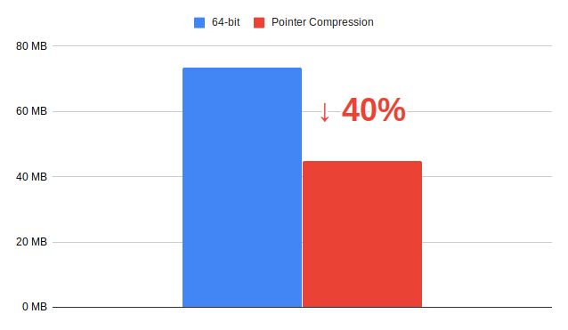

# 初期作成手順

## nodejs の最新情報を確認

なお、奇数番目は最新だが動作保証はないため、基本は偶数番目を利用する。

[https://github.com/nodejs/Release](https://github.com/nodejs/Release)

この当時の Active LTS は 12.16.3 だったが、以下観点から 14.2.0 を採用した

* このコードの変更者は当面 @shimomuh のみ
* サポート終了が 12.x は April 2022 に対し、 14.x は April 2023
* 14 は v8 8.0 を採用しておりヒープメモリを 40% 削減できるため、高速なサービス提供が可能



## ndenv を使って nodejs をインストール

まずは ndenv が nodejs の最新バイナリを管理している node-build を最新化

```zsh
cd ~/.ndenv/plugins/node-build/
git pull origin master
```

改めて v14 のインストール可能な最新版を確認する

```zsh
ndenv install --list | grep v14
```

この時最新は v14.2.0 だったため `.node-version` ファイルにその旨記載する

```zsh
echo "v14.2.0" > .node-version
```

ndenv は `.node-version` ファイルがあれば指定のバージョンを取ってきてくれるお利口さん

```zsh
ndenv install
```

## create-react-app をベースに作る

思想の基本としてコピペコードは不明確な実装を増やすだけで一時的な高速サービス提供が可能となってもメンテナンスリスクの向上やバグ発生時の対処速度に大きく差が出る

そのため、公式サイトの情報を参考に他サイトを参考にして理解できたものだけ自分のコードに落とし込む

今回は作り慣れている react / redux で作成予定だが、しばらくフロントエンドを離れていることもあって変わった部分も多々あると思われるので、 [https://ja.reactjs.org/docs/create-a-new-react-app.html](https://ja.reactjs.org/docs/create-a-new-react-app.html) を参考に進める

```zsh
npx create-react-app a-bit-close-project --template typescript
mv -f a-bit-close-project/* .
mv a-bit-close-project/.gitignore .
rm -rf a-bit-close-project
```

## 動作確認

一通り動作確認

```zsh
npm run start
npm run build
npm run test
```

